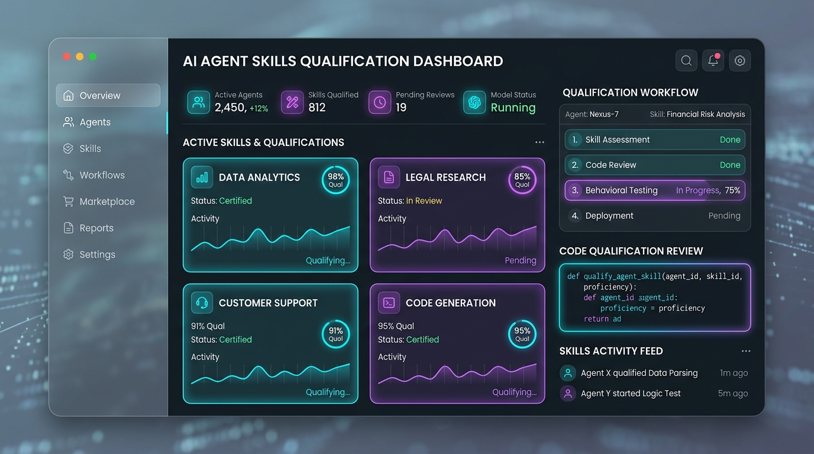
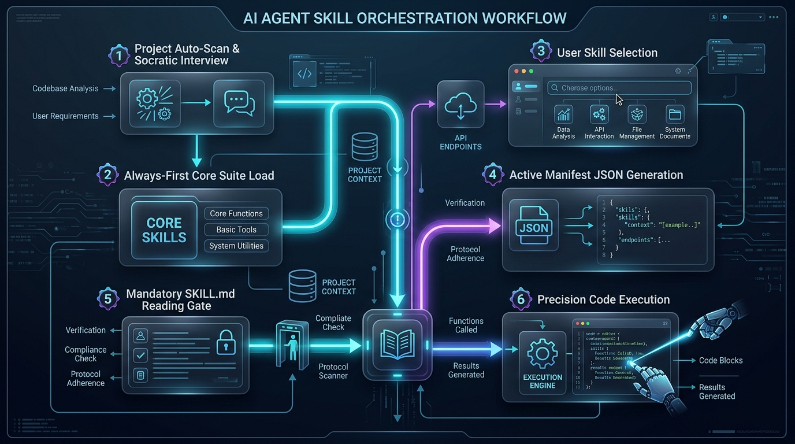
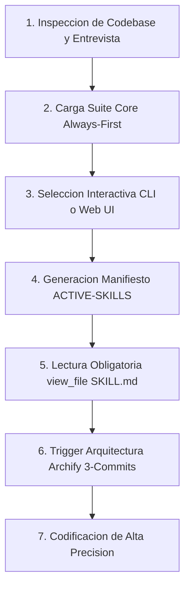
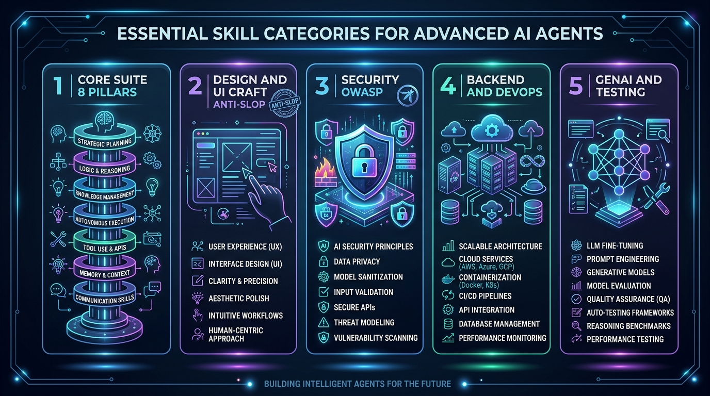

# 🚀 SuperDuperSkills

<p align="center">
  
  <a href="https://camilolealdev.github.io/superduperskills/"></a>
</p>

<p align="center">
  
</p>

<p align="center">
  <a href="https://github.com/camilolealdev/superduperskills"></a>
  <a href="AGENTS.md"></a>
  <a href="LICENSE"></a>
  <a href="docs/index.html"></a>
</p>

<h3 align="center">
  <em>Universal Multi-CLI AI Agent Skills Ecosystem & Interactive Project Qualification Engine</em>
</h3>

---

## 📑 Tabla de Contenidos

- [Visión General & Compatibilidad Multi-CLI](#-visión-general--compatibilidad-multi-cli)
- [Arquitectura del Orquestador de Agentes](#-arquitectura-del-orquestador-de-agentes)
- [Sistema Dual de Cualificación (CLI + Web UI)](#-sistema-dual-de-cualificación-cli--web-ui)
- [Categorías de Habilidades e Infografía](#-categorías-de-habilidades-e-infografía)
- [Suite Core de Invocación Obligatoria (Always-First)](#-suite-core-de-invocación-obligatoria-always-first)
- [Paquetes e Integraciones Clave](#-paquetes-e-integraciones-clave)
- [Guía de Instalación por CLI Host](#-guía-de-instalación-por-cli-host)

---

## 🌐 Visión General & Compatibilidad Multi-CLI

**SuperDuperSkills** es totalmente compatible de forma nativa con los **ejecutores y harnesses de IA más populares del mundo**:

| Harness / AI CLI | Ruta de Skills Local | Protocolo / Integración |
|------------------|----------------------|-------------------------|
| **Claude Code** | `~/.claude/skills/` | Plugin Marketplace & Hooks |
| **Gemini CLI / Antigravity (AGY)** | `~/.gemini/antigravity-ide/` / `~/.agents/skills/` | Direct AGY Skill SDK & Auto-load |
| **OpenAI Codex CLI** | `~/.codex/skills/` | Codex Plugins & Hooks |
| **Cursor Agent** | `.cursor/skills/` / `~/.cursor/skills/` | Rules for AI & Agent Skills |
| **OpenCode** | `~/.config/opencode/skills/` | opencode.json & NPM plugins |
| **Grok Build CLI** | `.grok/skills/` | Grok Plugin Trust System |
| **Devin CLI** | `~/.devin/skills/` | Devin Plugin Marketplace |
| **Kimi Code & Factory Droid** | `~/.droid/skills/` | Native Skill Specification |

---

## 🏗️ Arquitectura del Orquestador de Agentes

El Orquestador evalúa la estructura del proyecto y realiza una **entrevista o escaneo automático** para determinar los objetivos reales del usuario antes de permitir la generación de código.

<p align="center">
  
</p>

### Diagrama del Flujo de Trabajo:



1. **Inspección Automática / Entrevista Socrática**: Detecta archivos de configuración (`package.json`, `requirements.txt`, `go.mod`, `pubspec.yaml`, `Dockerfile`).
2. **Carga Incondicional Core**: Siempre añade las 9 skills de infraestructura y compresión antes de cualquier otra regla.
3. **Generación de Manifiesto (`.agents/ACTIVE-SKILLS.json`)**: Registra la fase del proyecto, los objetivos clave y las rutas locales exactas.
4. **Puerta de Lectura Obligatoria (`view_file`)**: Ningún agente AI puede escribir código sin haber leído con `view_file` el archivo `SKILL.md` de cada skill cualificada.

---

## 🎨 Categorías de Habilidades e Infografía

SuperDuperSkills agrupa sus **2,705+ habilidades** en 5 categorías fundamentales:

<p align="center">
  
</p>

### 1. Suite Core (8 Pilares + Archify)
Optimizaciones de compresión de tokens, arquitectura YAGNI, memoria persistente entre sesiones y diagramas de arquitectura interactivos.

### 2. Design & UI Craft Anti-Slop
Criterios de diseño e ingeniería de Emil Kowalski (11 skills), Impeccable (23 comandos), Taste Skill y Apple HIG.

### 3. Seguridad OWASP & Vulnerabilidades
Auditorías de código, escaneo de secretos, threat modeling y mejores prácticas de seguridad en GenAI.

### 4. Backend & DevOps
Patrones en Node.js, Python, Go, .NET, Docker, Kubernetes, Cloudflare Workers y pipelines de CI/CD.

### 5. GenAI & Testing
Workflows TDD, Playwright E2E, integraciones con Gemini SDK, HuggingFace y evaluadores de modelos.

---

## ⚡ Suite Core de Invocación Obligatoria (Always-First)

> [!IMPORTANT]
> **REGLA DE ORDEN DE EJECUCIÓN:** Todo agente AI debe invocar y consultar de primero esta suite:

| # | Skill | Propósito & Invocación |
|---|-------|------------------------|
| **1** | `caveman` | Compresión de salida (-75% tokens sin perder precisión técnica). |
| **2** | `ponytail` | Escala YAGNI (stdlib > deps nativas > código mínimo). |
| **3** | `spec-kit` / `spec-driven` | Especificación previa basada en [GitHub Spec Kit](https://github.com/github/spec-kit). |
| **4** | `token-savings` | Confirma selección de skills para mantener el prompt metadata magro. |
| **5** | `harness` / `agent-harness` | Define arneses de pruebas y validación continua. |
| **6** | `claude-mem` | Memoria persistente de decisiones arquitectónicas entre sesiones. |
| **7** | `rtk` | Proxy de terminal (Rust Token Killer) que comprime logs entre 60% y 90%. |
| **8** | `graphify` | Grafo de conocimiento del código para responder dependencias sin re-leer archivos. |
| **9** | `archify` | **Trigger Obligatorio**: Lectura mandatoria con `view_file` cada **3 commits de arquitectura**. |
| **10** | `skill-seekers` | Ingesta y búsqueda activa de habilidades desde repositorios remotos. |
| **11** | `skill-vault` | Almacenamiento y versión congelada de la bóveda de skills. |
| **12** | `all-deploy` | Scripts de despliegue universal (VPS Docker, Vercel, Railway, Cloudflare). |
| **13** | `context-mode` | Compresión dinámica y gestión limpia del contexto de sesión. |
| **14** | `aprende-skill` | Asimilación rápida y síntesis de nuevos dominios técnicos. |
| **15** | `agentshield` | Desinfección de prompts, secretos y prevención de comandos destructivos. |
| **16** | `modo-tdah` | Respuestas directas, ultra-concisas y ejecución sin explicaciones infladas. |
| **17** | `agentic-awesome-skills` | Patrones curados para agentes autónomos y multi-agente. |
| **18** | `gsd-core` | Framework Get Shit Done para avanzar objetivos sin bloqueos. |
| **19** | `i-have-adhd` | Formateo Action-First: respuesta sin rodeos, pasos numerados y metas claras. |

---

## 🚀 Paquetes e Integraciones Clave

- 📐 **`tt-a1i/archify`**: Diagramas interactivos de arquitectura (`docs/architecture.html`).
- 📚 **`openclaw/technical-documentation`**: Especificación técnica y 5 playbooks de gobernanza.
- 🎨 **`emilkowalski/skills`**: 11 habilidades de UI y animación (`emil-design-eng`, `animate`, `animate-expo`, `ask-sonner`...).
- 💎 **`pbakaus/impeccable`**: Suite de 23 comandos de interfaz (`/impeccable polish`, `critique`, `bolder`, `harden`...).
- ⚡ **`obra/superpowers`**: 6 habilidades de metodología ágil de ingeniería.
- 🔥 **`Leonxlnx/taste-skill`**: Framework anti-slop frontend.
- 🎭 **`nolly-studio/cult-ui` & `alchaincyf/huashu-design`**: Componentes visuales de vanguardia y micro-detalles.

---

## 💻 Centro de Comando & CLI Agentico (NPX / PNPM / Python)

### ⚡ Ejecución Inmediata (Zero-Install con NPX o PNPM):
```bash
# Con NPX:
npx superduperskills

# Con PNPM:
pnpm dlx superduperskills

# O con Python nativo:
python scripts/superduper_cli.py
```

### Comandos Rápidos del CLI:
```bash
# 🔍 Escaneo profundo de stack, frameworks y dependencias del repo
python scripts/superduper_cli.py scan

# 📋 Listar skills activas en el manifiesto
python scripts/superduper_cli.py list

# 🎛️ Activar / Desactivar una skill específica
python scripts/superduper_cli.py toggle emil-design-eng

# 🔎 Buscar en la bóveda de 2,700+ skills
python scripts/superduper_cli.py search "nextjs"

# 📥 Ingestar skill remota con Skill Seekers
python scripts/superduper_cli.py ingest "https://github.com/autor/nueva-skill"

# 🔄 Sincronizar configuraciones Multi-CLI (Cursor, Claude, OpenCode)
python scripts/superduper_cli.py sync

# 🧪 Auditar presencia física de SKILL.md de las habilidades activas
python scripts/superduper_cli.py audit
```

---

## 📂 Mapa del Repositorio

| Ruta / Archivo | Descripción |
|----------------|-------------|
| [`AGENTS.md`](file:///g:/Nueva%20carpeta/Documentos/superduperskills/AGENTS.md) | Guía mandatoria global para agentes (Suite Core + Protocolos de Cualificación). |
| [`SKILLS-INDEX.md`](file:///g:/Nueva%20carpeta/Documentos/superduperskills/SKILLS-INDEX.md) | Índice deduplicado con las 2,705+ skills indexadas. |
| [`UNIFIED-KNOWLEDGE.md`](file:///g:/Nueva%20carpeta/Documentos/superduperskills/UNIFIED-KNOWLEDGE.md) | Taxonomía multi-conocimiento unificada. |
| [`scripts/superduper_cli.py`](file:///g:/Nueva%20carpeta/Documentos/superduperskills/scripts/superduper_cli.py) | **Centro de Control & CLI Agentico** (Discovery, Toggles, Vault Search & Multi-CLI Sync). |
| [`scripts/qualify_project.py`](file:///g:/Nueva%20carpeta/Documentos/superduperskills/scripts/qualify_project.py) | Wizard interactivo socrático de cualificación. |
| [`web/qualifier.html`](file:///g:/Nueva%20carpeta/Documentos/superduperskills/web/qualifier.html) | Dashboard web interactivo Glassmorphism. |
| [`skills/`](file:///g:/Nueva%20carpeta/Documentos/superduperskills/skills/) | Directorio raíz de paquetes `SKILL.md`. |

