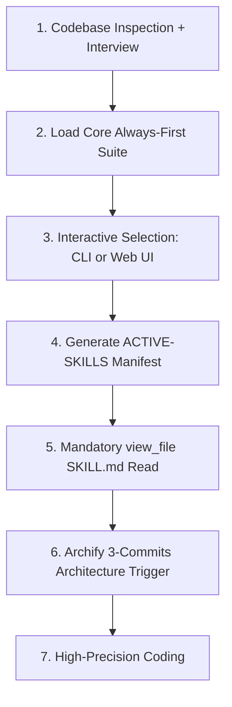

# 🚀 SuperDuperSkills

> **🇬🇧 EN / 🇪🇸 ES — Bilingual documentation.**
> The ultimate multi-agent skills vault & governance suite: **3,900+ curated `SKILL.md` files** (3,300+ bundled entries from **30+ verified source libraries**) for Claude Code, Gemini CLI, OpenAI Codex, Cursor, OpenCode and every major AI agent — with an interactive web catalog and a project-qualification engine.

---

<p align="center">
  
  <a href="https://camilolealdev.github.io/superduperskills/"></a>
  <a href="https://superduperskills.vercel.app/"></a>
</p>

<p align="center">
  
</p>

<p align="center">
  <a href="#-overview--visión-general"></a>
  <a href="LICENSE"></a>
  <a href="#-author--autor"></a>
  <a href="docs/index.html"></a>
  <a href="AGENTS.md"></a>
</p>

---

## 📑 Table of Contents · Tabla de Contenidos

| 🇬🇧 English | 🇪🇸 Español |
|---|---|
| [Overview](#-overview) | [Visión General](#-overview--visión-general) |
| [Features](#-features--características) | [Características](#-features--características) |
| [Multi-CLI Compatibility](#-multi-cli-compatibility--compatibilidad-multi-cli) | [Compatibilidad Multi-CLI](#-multi-cli-compatibility--compatibilidad-multi-cli) |
| [Catalog Stats](#-catalog-stats--estadísticas-del-catálogo) | [Estadísticas del Catálogo](#-catalog-stats--estadísticas-del-catálogo) |
| [Repository Structure](#-repository-structure--estructura-del-repositorio) | [Estructura del Repositorio](#-repository-structure--estructura-del-repositorio) |
| [Quick Start / Installation](#-quick-start--instalación-rápida) | [Inicio Rápido / Instalación](#-quick-start--instalación-rápida) |
| [CLI Usage](#-cli-command-center--centro-de-comando-cli) | [Uso del CLI](#-cli-command-center--centro-de-comando-cli) |
| [Agent Orchestrator & Qualification](#-agent-orchestrator--orquestador-de-agentes) | [Orquestador de Agentes](#-agent-orchestrator--orquestador-de-agentes) |
| [Core Always-First Suite](#-core-always-first-suite--suite-core-obligatoria) | [Suite Core Obligatoria](#-core-always-first-suite--suite-core-obligatoria) |
| [Documentation Hub](#-documentation--documentación) | [Centro de Documentación](#-documentation--documentación) |
| [Development](#-development--desarrollo) | [Desarrollo](#-development--desarrollo) |
| [Author & License](#-author--autor) | [Autor y Licencia](#-author--autor) |
| [Contributing / Security](#-contributing--seguridad) | [Contribuciones / Seguridad](#-contributing--seguridad) |

---

## 🌐 Overview · Visión General

### 🇬🇧 English

**SuperDuperSkills** is a **universal, multi-CLI AI-agent skills ecosystem**. It bundles thousands of professionally maintained agent skills — reusable, self-contained instruction packages (`SKILL.md`) — from 30+ verified open-source libraries, **deduplicates them**, organizes them into **17 categories**, and installs them natively into whichever AI coding tool you use.

It also ships an **Interactive Project Qualification Engine**: before any code is generated, an orchestrator inspects your repository (or interviews you) to qualify which skills actually apply to your project, so agents load only what they need — saving tokens and avoiding prompt bloat.

**Why it exists:** AI agents (Claude Code, Gemini CLI, Codex, Cursor…) each have their own native *skills* format. Until now, a skill written for one tool had to be rewritten for every other tool. SuperDuperSkills is a single, tool-agnostic vault that maps each skill into every harness:

| Harness / AI CLI | Local Skills Path | Protocol / Integration |
|------------------|-------------------|-------------------------|
| **Claude Code** | `~/.claude/skills/` | Plugin Marketplace & Hooks |
| **Gemini CLI / Antigravity (AGY)** | `~/.gemini/antigravity-ide/` · `~/.agents/skills/` | Direct AGY Skill SDK & Auto-load |
| **OpenAI Codex CLI** | `~/.codex/skills/` | Codex Plugins & Hooks |
| **Cursor Agent** | `.cursor/skills/` · `~/.cursor/skills/` | Rules for AI & Agent Skills |
| **OpenCode** | `~/.config/opencode/skills/` | `opencode.json` & NPM plugins |
| **Grok Build CLI** | `.grok/skills/` | Grok Plugin Trust System |
| **Devin CLI** | `~/.devin/skills/` | Devin Plugin Marketplace |
| **Kimi Code & Factory Droid** | `~/.droid/skills/` | Native Skill Specification |

### 🇪🇸 Español

**SuperDuperSkills** es un **ecosistema universal de skills para agentes de IA multi-CLI**. Agrupa miles de skills profesionales mantenidas por la comunidad — paquetes de instrucciones reutilizables (`SKILL.md`) — provenientes de **más de 30 librerías open-source verificadas**, las **deduplica**, las organiza en **17 categorías** y las instala de forma nativa en la herramienta de IA que uses.

Incluye además un **Motor Interactivo de Cualificación de Proyectos**: antes de generar código, un orquestador inspecciona tu repositorio (o te entrevista) para cualificar qué skills aplican realmente a tu proyecto, de modo que los agentes carguen solo lo necesario — ahorrando tokens y evitando inflar el prompt.

**Por qué existe:** cada agente de IA (Claude Code, Gemini CLI, Codex, Cursor…) tiene su propio formato nativo de *skills*. Hasta ahora, una skill escrita para una herramienta debía reescribirse para las demás. SuperDuperSkills es una única bóveda agnóstica que mapea cada skill a cada harness (ver tabla de compatibilidad arriba).

---

## ✨ Features · Características

### 🇬🇧 English

- **🧠 One vault, every agent** — Universal skill format installed natively across 8+ AI CLIs and IDEs.
- **🔁 Zero duplicates** — A merge-map + index pipeline deduplicates by skill name and canonical repo.
- **🎯 Project qualification engine** — CLI wizard (`qualify_project.py`) and interactive Web dashboard (`qualifier.html`) that ask *what are you building?* before suggesting skills.
- **📊 Interactive web catalog** — Searchable, themeable (dark/light), PWA-ready UI with live category breakdowns.
- **⚡ Zero-install CLI** — Run instantly with `npx superduperskills`, `pnpm dlx`, or the native Python CLI.
- **🛡️ Governance & safety** — Mandatory “Always-First” core suite (token compression, YAGNI, spec-first, memory, anti-destructive-command rules).
- **🔌 Plugin-ready** — Claude Code / Cursor / OpenCode plugin manifests, shell completions, hooks.
- **📦 Python & Node dual runtime** — Same feature set from `bin/superduperskills.js` or `scripts/superduper_cli.py`.
- **🌍 Bilingual project** — README, guides and site content maintained in English **and** Spanish.

### 🇪🇸 Español

- **🧠 Una bóveda, todos los agentes** — Formato universal de skills instalado de forma nativa en más de 8 CLIs e IDEs de IA.
- **🔁 Cero duplicados** — Pipeline de merge-map e índice que deduplica por nombre de skill y repositorio canónico.
- **🎯 Motor de cualificación** — Wizard CLI (`qualify_project.py`) y dashboard web interactivo (`qualifier.html`) que preguntan *¿qué estás construyendo?* antes de sugerir skills.
- **📊 Catálogo web interactivo** — UI con búsqueda, temas claro/oscuro, lista para PWA y desglose por categorías.
- **⚡ CLI sin instalación** — Ejecuta al instante con `npx superduperskills`, `pnpm dlx` o el CLI nativo de Python.
- **🛡️ Gobernanza y seguridad** — Suite core “Always-First” obligatoria (compresión de tokens, YAGNI, spec-first, memoria, reglas anti-comandos destructivos).
- **🔌 Listo para plugins** — Manifiestos de plugin para Claude Code / Cursor / OpenCode, completions de shell, hooks.
- **📦 Runtime dual Node/Python** — Mismas funciones desde `bin/superduperskills.js` o `scripts/superduper_cli.py`.
- **🌍 Proyecto bilingüe** — README, guías y contenido del sitio mantenidos en inglés **y** español.

---

## 📊 Catalog Stats · Estadísticas del Catálogo

| Metric · Métrica | Value · Valor |
|---|---|
| 🗂️ Bundled `SKILL.md` files (bóveda) | **3,900+** |
| 📦 Bundled skill entries in `skills/` | **3,300+** |
| 🏷️ Skill categories | **17** |
| 📚 Verified source libraries | **30+** |
| 🤖 Supported AI CLIs | **8+** |
| 🧪 Install time (typical) | **< 30 seconds** |
| 📄 Core documentation files | 4 main docs + bilingual guides |

> **Note / Nota:** counts are measured live from the repository (`skills/`, `SKILLS-INDEX.md`). The interactive site shows live per-category counters that auto-generate from the index.

---

## 🗂️ Repository Structure · Estructura del Repositorio

| Ruta / Path | Descripción (EN) | Descripción (ES) |
|---|---|---|
| [`AGENTS.md`](AGENTS.md) | Mandatory global guide for agents (Core Suite + qualification protocols). | Guía global obligatoria para agentes (Suite Core + protocolos de cualificación). |
| [`README.md`](README.md) | This bilingual documentation. | Esta documentación bilingüe. |
| [`LICENSE`](LICENSE) | MIT license & copyright. | Licencia MIT y copyright. |
| [`CONTRIBUTING.md`](CONTRIBUTING.md) | How to add skills & contribute. | Cómo añadir skills y contribuir. |
| [`SECURITY.md`](SECURITY.md) | Vulnerability reporting policy. | Política de reporte de vulnerabilidades. |
| [`CODE_OF_CONDUCT.md`](CODE_OF_CONDUCT.md) | Contributor covenant (ES/EN). | Pacto de contribución (ES/EN). |
| [`CHANGELOG.md`](CHANGELOG.md) | Version history. | Historial de versiones. |
| [`SKILLS-INDEX.md`](SKILLS-INDEX.md) | Deduplicated index of 3,300+ bundled skills with source repos. | Índice deduplicado de 3,300+ skills con repos de origen. |
| [`UNIFIED-KNOWLEDGE.md`](UNIFIED-KNOWLEDGE.md) | Unified multi-knowledge taxonomy & duplicate merge-map. | Taxonomía multi-conocimiento unificada y merge-map de duplicados. |
| [`skills-inventory.md`](skills-inventory.md) | Inventory per source repository. | Inventario por repositorio de origen. |
| [`install.sh`](install.sh) | Linux/macOS installer (multi-target, dry-run). | Instalador Linux/macOS (multi-target, dry-run). |
| [`install.ps1`](install.ps1) | Windows PowerShell installer. | Instalador Windows PowerShell. |
| [`package.json`](package.json) | Node package + CLI entry (`bin/`). | Paquete Node + entrada CLI (`bin/`). |
| [`pyproject.toml`](pyproject.toml) · [`setup.py`](setup.py) | Python packaging. | Empaquetado Python. |
| [`scripts/build_index.py`](scripts/build_index.py) | Index builder: scans → dedup → `SKILLS-INDEX.md`. | Constructor de índice: escaneo → dedup → `SKILLS-INDEX.md`. |
| [`scripts/superduper_cli.py`](scripts/superduper_cli.py) | **Python Command Center** (TUI dashboard, AI assistant, dependency graphs, multi-CLI sync). | **Centro de Control Python** (dashboard TUI, asistente IA, grafos de dependencias, sync multi-CLI). |
| [`scripts/qualify_project.py`](scripts/qualify_project.py) | Socratic interactive qualification wizard. | Wizard interactivo socrático de cualificación. |
| [`bin/superduperskills.js`](bin/superduperskills.js) | Node CLI (same commands, JS runtime). | CLI Node (mismos comandos, runtime JS). |
| [`web/skills-site.html`](web/skills-site.html) | **Canonical** interactive catalog source. | Fuente **canónica** del catálogo interactivo. |
| [`web/qualifier.html`](web/qualifier.html) | Web qualification dashboard (Glassmorphism). | Dashboard web de cualificación (Glassmorphism). |
| [`docs/index.html`](docs/index.html) | Built site copy (GitHub Pages). | Copia construida del sitio (GitHub Pages). |
| [`index.html`](index.html) | Root/Vercel site copy with extra OG meta. | Copia raíz/Vercel del sitio con OG meta extra. |
| [`docs/assets/`](docs/assets/) | README images (hero, diagrams, infographics). | Imágenes del README (hero, diagramas, infografías). |
| [`skills/`](skills/) | **The vault** — 3,325+ packaged skills (each `SKILL.md`). | **La bóveda** — 3,325+ skills empaquetadas (cada `SKILL.md`). |
| [`.github/workflows/`](.github/workflows/) | CI: build/minify site, GH-Pages deploy, PR previews. | CI: build/minify sitio, deploy GH-Pages, previews de PRs. |

---

## 🚀 Quick Start · Instalación Rápida

### 🇬🇧 English — Install the vault

```bash
# 1) Clone
git clone https://github.com/camilolealdev/superduperskills.git
cd superduperskills

# 2) Linux / macOS — install into your preferred AI CLI
./install.sh --target claude     # Claude Code
./install.sh --target gemini     # Gemini CLI / Antigravity
./install.sh --target all        # every supported harness
./install.sh --dry-run           # preview without writing

# 3) Windows PowerShell
.\install.ps1 -Target claude     # or: -Target all
```

### 🇪🇸 Español — Instala la bóveda

```bash
# 1) Clonar
git clone https://github.com/camilolealdev/superduperskills.git
cd superduperskills

# 2) Linux / macOS — instala en tu CLI de IA preferido
./install.sh --target claude     # Claude Code
./install.sh --target gemini     # Gemini CLI / Antigravity
./install.sh --target all        # todos los harness soportados
./install.sh --dry-run           # vista previa sin escribir nada

# 3) Windows PowerShell
.\install.ps1 -Target claude     # o: -Target all
```

### 🇬🇧 English — Run the CLI (zero install)

```bash
npx superduperskills        # Node runtime (anywhere)
pnpm dlx superduperskills   # pnpm equivalent
python scripts/superduper_cli.py ui   # native Python TUI (mouse & fuzzy search)
```

### 🇪🇸 Español — Ejecuta el CLI (sin instalación)

```bash
npx superduperskills        # runtime Node (en cualquier sitio)
pnpm dlx superduperskills   # equivalente con pnpm
python scripts/superduper_cli.py ui   # TUI nativa Python (ratón y búsqueda fuzzy)
```

---

## 💻 CLI Command Center · Centro de Comando CLI (v6.0.0 «WorldClass»)

| Command · Comando | 🇬🇧 Purpose | 🇪🇸 Propósito |
|---|---|---|
| `ui` | 🖱️ Interactive TUI Dashboard (Mouse support, fuzzy search, live preview) | 🖱️ Dashboard TUI interactivo (Soporte de ratón, búsqueda fuzzy, preview) |
| `ask "<query>"` | 🤖 Local Semantic AI Assistant with RAG & streaming | 🤖 Asistente IA semántico local con RAG y streaming |
| `why <skill>` | 🔍 Architectural justification & token breakdown | 🔍 Justificación arquitectónica y desglose de tokens |
| `graph` | 🕸️ ASCII Dependency & synergy graph between skills | 🕸️ Grafo ASCII de dependencias y sinergias entre skills |
| `benchmark` | ⚡ Latency & resolution throughput benchmark | ⚡ Benchmark de latencia de resolución y rendimiento |
| `budget <tokens>`| 💰 Token budget optimizer for context windows | 💰 Optimizador de presupuesto de tokens para ventanas de contexto |
| `auto-branch` | 🌿 Intent-based Git branch auto-generator | 🌿 Generador automático de ramas Git basado en intención |
| `mode <profile>` | ⚙️ Switch execution profiles (`fast`, `deep`, `audit`, `budget`) | ⚙️ Conmutar perfiles de ejecución (`fast`, `deep`, `audit`, `budget`) |
| `scan` | Deep scan of repo stack, frameworks & dependencies | Escaneo profundo del stack, frameworks y dependencias |
| `list` | List active skills in the manifest | Listar skills activas del manifiesto |
| `toggle <skill>` | Enable / disable a skill | Activar / desactivar una skill |
| `search "<query>"` | Search the vault with fuzzy matching | Buscar en la bóveda con coincidencia difusa |
| `ingest <url>` | Ingest a remote skill (Skill Seekers) | Ingerir skill remota (Skill Seekers) |
| `sync` | Sync config across Cursor, Claude, OpenCode… | Sincronizar configs multi-CLI |
| `audit` | Verify physical `SKILL.md` presence of active skills | Auditar presencia física de `SKILL.md` |
| `wizard` | Socratic interactive qualification interview | Entrevista de cualificación interactiva |
| `stats` | Live vault statistics & category metrics | Estadísticas de la bóveda en vivo |
| `doctor` | Comprehensive environment & tool health check | Chequeo de salud del entorno y herramientas |
| `completions` | Install shell completions (bash, zsh, powershell) | Instalar autocompletado para shell |

```bash
# 🖱️ Dashboard interactivo con ratón
python scripts/superduper_cli.py ui

# 🤖 Preguntarle a la IA
python scripts/superduper_cli.py ask "How to build a clean architecture API in FastAPI?"

# 🔍 Justificar por qué usar una skill
python scripts/superduper_cli.py why emil-design-eng

# 🕸️ Analizar dependencias
python scripts/superduper_cli.py graph --target tailwind-patterns

# ⚡ Ejecutar benchmark de rendimiento
python scripts/superduper_cli.py benchmark

# 💰 Ajustar skills a un presupuesto de 8,000 tokens
python scripts/superduper_cli.py budget 8000
```

---

## 🎛️ Agent Orchestrator · Orquestador de Agentes

### 🇬🇧 English

The **Agent Orchestrator** evaluates your project structure and performs an **interview or automatic scan** to determine your real goals *before* it allows code generation:

<p align="center">
  
</p>



1. **Automatic Inspection / Socratic Interview** — detects config files (`package.json`, `requirements.txt`, `go.mod`, `pubspec.yaml`, `Dockerfile`).
2. **Unconditional Core Load** — always injects the 9 infrastructure & compression skills before any other rule.
3. **Manifest generation (`.agents/ACTIVE-SKILLS.json`)** — records project phase, key goals and exact local skill paths.
4. **Mandatory read gate (`view_file`)** — no AI agent writes code without first reading each qualified skill's `SKILL.md`.

### 🇪🇸 Español

El **Orquestador de Agentes** evalúa la estructura de tu proyecto y realiza una **entrevista o escaneo automático** para determinar tus objetivos reales *antes* de permitir la generación de código (ver diagrama de arriba):

1. **Inspección Automática / Entrevista Socrática** — detecta archivos de configuración (`package.json`, `requirements.txt`, `go.mod`, `pubspec.yaml`, `Dockerfile`).
2. **Carga Incondicional Core** — inyecta siempre las 9 skills de infraestructura y compresión antes que cualquier otra regla.
3. **Generación del manifiesto (`.agents/ACTIVE-SKILLS.json`)** — registra la fase del proyecto, objetivos clave y rutas locales exactas.
4. **Puerta de lectura obligatoria (`view_file`)** — ningún agente de IA escribe código sin leer antes el `SKILL.md` de cada skill cualificada.

### 🎨 Skill Categories · Categorías (EN + ES)

SuperDuperSkills organizes its **17 categories** (see `docs/assets/categories-infographic.jpg`) into five fundamental groups:

1. **Core Suite** — token-compression, YAGNI architecture, persistent memory, interactive architecture diagrams.
2. **Design & UI Craft (Anti-Slop)** — Emil Kowalski's design engineering (11 skills), Impeccable (23 commands), Taste framework, Apple HIG.
3. **OWASP Security & Vulnerabilities** — code audits, secret scanning, threat modeling, GenAI security best practices.
4. **Backend & DevOps** — Node.js, Python, Go, .NET, Docker, Kubernetes, Cloudflare Workers, CI/CD pipelines.
5. **GenAI & Testing** — TDD workflows, Playwright E2E, Gemini SDK, HuggingFace, model evaluators.

---

## ⚡ Core Always-First Suite · Suite Core Obligatoria

> [!IMPORTANT]
> **REGLA DE ORDEN DE EJECUCIÓN / EXECUTION-ORDER RULE:** every AI agent must load this suite first:

| # | Skill | 🇬🇧 Purpose | 🇪🇸 Propósito |
|---|-------|-------------|--------------|
| 1 | `caveman` | Output compression (-75% tokens, no accuracy loss) | Compresión de salida (-75% tokens) |
| 2 | `ponytail` | YAGNI ladder (stdlib → native deps → minimal code) | Escala YAGNI |
| 3 | `spec-kit` | Specification-first development | Especificación previa (Spec Kit) |
| 4 | `token-savings` | Keep prompt metadata lean before work starts | Confirma skills y ahorra tokens |
| 5 | `harness` / `agent-harness` | Test harnesses & continuous validation | Arneses de pruebas y validación |
| 6 | `claude-mem` | Persistent architectural memory between sessions | Memoria persistente entre sesiones |
| 7 | `rtk` | Terminal log compression (60–90%) | Compresión de logs de terminal |
| 8 | `graphify` | Code knowledge graph without re-reading files | Grafo de conocimiento del código |
| 9 | `archify` | **Mandatory** architecture trigger each 3 commits | Trigger de arquitectura cada 3 commits |
| 10 | `skill-seekers` | Active remote-skill discovery & ingestion | Ingesta y descubrimiento de skills |
| 11 | `skill-vault` | Frozen, versioned skill vault | Bóveda congelada y versionada |
| 12 | `all-deploy` | Universal deployment scripts | Despliegue universal |
| 13 | `context-mode` | Dynamic context-window management | Gestión dinámica del contexto |
| 14 | `aprende-skill` | Fast domain assimilation & synthesis | Asimilación rápida de dominios |
| 15 | `agentshield` | Prompt/secret sanitization, destructive-command guard | Desinfección y guardas de seguridad |
| 16 | `modo-tdah` | Ultra-concise, direct responses | Respuestas ultra-concisas |
| 17 | `agentic-awesome-skills` | Curated autonomous & multi-agent patterns | Patrones multi-agente curados |
| 18 | `gsd-core` | “Get Shit Done” progress framework | Framework de avance sin bloqueos |
| 19 | `i-have-adhd` | Action-first formatting (no fluff, numbered steps) | Formato Action-First |

> Full operating details live in [`AGENTS.md`](AGENTS.md) · Los detalles operativos completos viven en [`AGENTS.md`](AGENTS.md).

---

## 📚 Documentation · Documentación

| File · Archivo | 🇬🇧 | 🇪🇸 |
|---|---|---|
| [`AGENTS.md`](AGENTS.md) | Mandatory agent protocol | Protocolo obligatorio para agentes |
| [`SKILLS-INDEX.md`](SKILLS-INDEX.md) | Full deduplicated catalog index | Índice completo del catálogo |
| [`UNIFIED-KNOWLEDGE.md`](UNIFIED-KNOWLEDGE.md) | Unified taxonomy & merge map | Taxonomía unificada y merge map |
| [`skills-inventory.md`](skills-inventory.md) | Inventory by source repo | Inventario por repo de origen |
| [`docs/CORE-EXECUTION-SUITE.md`](docs/CORE-EXECUTION-SUITE.md) | Execution-suite details | Detalles de la suite de ejecución |
| [`docs/STACK-BASED-SKILL-SELECTION.md`](docs/STACK-BASED-SKILL-SELECTION.md) | Stack-based selection guide | Guía de selección por stack |
| [`docs/SEO-AUDIT.md`](docs/SEO-AUDIT.md) | Site SEO audit notes | Notas de auditoría SEO del sitio |
| [`CHANGELOG.md`](CHANGELOG.md) | Version history (ES/EN) | Historial de versiones (ES/EN) |
| **Web UI** | [GitHub Pages live site](https://camilolealdev.github.io/superduperskills/) · [Vercel mirror](https://superduperskills.vercel.app/) | Sitio en vivo (GitHub Pages/Vercel) |

---

## 🛠️ Development · Desarrollo

### 🇬🇧 English

```bash
# Rebuild the deduplicated index after adding skills
python build_index.py

# Rebuild the minified web site (canonical: web/skills-site.html)
bash web/build.sh

# Rebuild preview / mirror copies
cp web/skills-site.html docs/index.html
cp web/skills-site.min.html docs/index.min.html
```

CI (`.github/workflows/build-site.yml`) does the same automatically on pushes that touch `web/` or `index.html`, then commits the built artifacts. PRs touching `web/**` or `docs/**` get a live preview via `.github/workflows/pr-preview.yml`.

### 🇪🇸 Español

```bash
# Reconstruir el índice deduplicado tras añadir skills
python build_index.py

# Reconstruir el sitio web minificado (canónico: web/skills-site.html)
bash web/build.sh

# Reconstruir copias de preview / espejo
cp web/skills-site.html docs/index.html
cp web/skills-site.min.html docs/index.min.html
```

El CI (`.github/workflows/build-site.yml`) hace lo mismo automáticamente en pushes que toquen `web/` o `index.html`, y hace commit de los artefactos construidos. Los PRs que toquen `web/**` o `docs/**` reciben un preview en vivo vía `.github/workflows/pr-preview.yml`.

---

## 👤 Author · Autor

| Field · Campo | Value · Valor |
|---|---|
| **Author / Mantainer** | **camilolealdev** (Camilo Leal) |
| **GitHub** | [github.com/camilolealdev](https://github.com/camilolealdev) |
| **Repository** | [github.com/camilolealdev/superduperskills](https://github.com/camilolealdev/superduperskills) |
| **Issues** | [github.com/camilolealdev/superduperskills/issues](https://github.com/camilolealdev/superduperskills/issues) |
| **Live site** | [camilolealdev.github.io/superduperskills](https://camilolealdev.github.io/superduperskills/) · [superduperskills.vercel.app](https://superduperskills.vercel.app/) |
| **X / Twitter** | [@camilolealdev](https://x.com/camilolealdev) |

**🇬🇧** Built and maintained by **Camilo Leal** (`camilolealdev`). Questions, feature ideas and skill submissions are welcome via [GitHub Issues](https://github.com/camilolealdev/superduperskills/issues).

**🇪🇸** Construido y mantenido por **Camilo Leal** (`camilolealdev`). Preguntas, ideas y envíos de skills son bienvenidos vía [GitHub Issues](https://github.com/camilolealdev/superduperskills/issues).

### Contributors · Contribuidores

Thanks to every open-source library bundled in this vault (see [`skills-inventory.md`](skills-inventory.md)) and to the community that keeps agent skills growing. You can join them — see [`CONTRIBUTING.md`](CONTRIBUTING.md).

---

## ⚖️ License · Licencia

```
MIT License

Copyright (c) 2025-2026 SuperDuperSkills contributors
Author / Maintainer: camilolealdev (Camilo Leal) — https://github.com/camilolealdev

Permission is hereby granted, free of charge, to any person obtaining a copy
of this software and associated documentation files (the "Software"), to deal
in the Software without restriction...
```

**🇬🇧** This project is released under the **MIT License** — see [`LICENSE`](LICENSE) for the full text. The bundled third-party skills remain under their **original licenses** (referenced in each library's own files inside `skills/`).

**🇪🇸** Este proyecto se publica bajo la **Licencia MIT** — ver [`LICENSE`](LICENSE) para el texto completo. Las skills de terceros agrupadas conservan sus **licencias originales** (referenciadas en los archivos de cada librería dentro de `skills/`).

---

## 🤝 Contributing · Seguridad

**🇬🇧** See [`CONTRIBUTING.md`](CONTRIBUTING.md) (add skills, report issues, code style) · [`SECURITY.md`](SECURITY.md) (report vulnerabilities) · [`CODE_OF_CONDUCT.md`](CODE_OF_CONDUCT.md).

**🇪🇸** Ver [`CONTRIBUTING.md`](CONTRIBUTING.md) (añadir skills, reportar issues, estilo) · [`SECURITY.md`](SECURITY.md) (reportar vulnerabilidades) · [`CODE_OF_CONDUCT.md`](CODE_OF_CONDUCT.md).

---

<p align="center">
  Made with 🧠 by <a href="https://github.com/camilolealdev">camilolealdev</a> · MIT · <a href="https://camilolealdev.github.io/superduperskills/">Live site</a>
</p>
