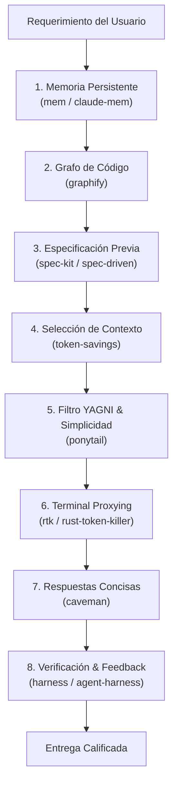

# Suite Core de Invocación Obligatoria para Agentes IA

> Documentación de arquitectura, aplicabilidad y reglas de ejecución para los **7 Pilares Fundamentales** de desarrollo agéntico en `superduperskills`.

---

## 1. Visión General

La **Suite Core** establece una metodología estandarizada para garantizar que cualquier agente de IA (Claude Code, Gemini CLI, Antigravity, OpenCode, Codex, Cursor, etc.) opere con la máxima eficiencia técnica, disciplina arquitectónica y ahorro de tokens.

Antes de construir o modificar cualquier módulo en un proyecto, el agente debe **consultar e invocar primero esta suite**.

---

## 2. Los 7 Pilares de Ejecución



### Pillar 1: `mem` / `claude-mem` (Memoria Persistente)
- **Propósito**: Recuperar y almacenar contexto arquitectónico, patrones preexistentes y decisiones previas entre sesiones.

### Pillar 2: `graphify` (Grafo de Conocimiento del Codebase)
- **Propósito**: Indexar símbolos, imports y llamadas de funciones para responder consultas de dependencias sin necesidad de releer 40+ archivos.

### Pillar 3: `spec-kit` / `spec-driven` (Especificación Técnica)
- **Propósito**: Aplicar [GitHub Spec Kit](https://github.com/github/spec-kit) para escribir requisitos, contratos de API, PRD y desglose de tareas antes de escribir código.
- **Comandos Slash**:
  - `/speckit.init`: Estructurar entorno SDD.
  - `/speckit.constitution`: Reglas no negociables del proyecto.
  - `/speckit.spec`: Documento de requisitos técnicos.
  - `/speckit.tasks`: Desglose secuencial de trabajo.

### Pillar 4: `token-savings` (Optimización de Carga)
- **Propósito**: Confirmar explícitamente cuáles skills aplican a la sesión para evitar cargar metadata pesada e irrelevante en el prompt.

### Pillar 5: `ponytail` (Disciplina Anti-Over-Engineering / YAGNI)
- **Propósito**: Forzar la solución más simple que funcione mediante la "Escala de Pereza Senior":
  1. ¿Necesita existir? (YAGNI).
  2. ¿Ya existe en el codebase? (Reutilizar).
  3. ¿Lo resuelve la stdlib? (Usar stdlib).
  4. ¿Lo resuelve el lenguaje / plataforma nativa? (Usar nativo).
  5. ¿Lo resuelve una librería ya instalada? (Usar dependencia existente).
  6. ¿Puede ser una línea? (Hacerlo en una línea).
  7. Código mínimo.

### Pillar 6: `rtk` (Rust Token Killer & Terminal Proxying)
- **Propósito**: Filtrar la salida de terminal (`git diff`, `npm test`, `pytest`, `cargo check`), reduciendo tokens de logs entre un 60% y 90% mediante deduplicación de stack traces y eliminación de ANSI codes.

### Pillar 7: `caveman` (Compresión de Comunicación)
- **Propósito**: Eliminar muletillas, introducciones vacías y explicaciones no solicitadas en las respuestas del agente, reduciendo el consumo de tokens de salida un 75% sin perder exactitud técnica.

### Pillar 8: `harness` / `agent-harness` (Verificación Automatizada)
- **Propósito**: Definir pruebas automatizadas y arneses de validación para confirmar que los cambios cumplen la especificación antes de finalizar la tarea.

---

## 3. Matriz de Combinación y Sinergia

| Combinación | Resultado en el Agente | Impacto en Producción |
|-------------|-------------------------|-----------------------|
| `spec-kit` + `ponytail` | Evita construir características no solicitadas y define contratos mínimos. | Cero código muerto, arquitectura limpia. |
| `rtk` + `caveman` | Comprime tanto la entrada de la terminal como la salida explicativa. | Reducción global del >80% en costos de tokens. |
| `mem` + `harness` | Recuerda errores pasados y los valida automáticamente. | Cero regresiones entre sesiones. |

---

## 4. Guía de Invocación Directa

Los agentes deben invocar estos skills usando las directivas estándar del entorno:

```markdown
- Para planificar un feature: /speckit.spec [feature]
- Para simplificar un diseño: /ponytail full
- Para comprimir explicaciones: /caveman full
- Para ejecutar tests comprimidos: rtk npm test
```
