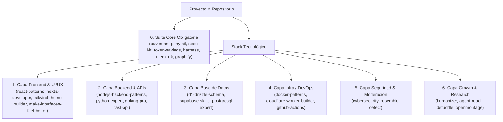

# Arquitectura de Selección de Skills basada en Stack Técnico

> Guía de arquitectura de clase mundial para ubicar, justificar y seleccionar el catálogo de skills en función del stack tecnológico real de cualquier proyecto.

---

## 1. Filosofía de Asignación por Stack

No todos los proyectos necesitan los 1300+ skills del catálogo. Para evitar el desperdicio de ventana de contexto (tokens) y prevenir que los agentes intenten usar herramientas irrelevantes, la arquitectura de selección ubica los skills en **capas de stack tecnológico**:



---

## 2. Matriz Explicativa por Capa Tecnológica

### Capa 0: Suite Core (Obligatoria para Todo Proyecto)
*Independiente del lenguaje o framework:*

| Skill | Función (Qué hace) | Razón de Selección (Por qué en este stack) |
|-------|--------------------|--------------------------------------------|
| **`caveman`** | Compresión de salida (-75% tokens). | Reduce respuestas extensas del agente manteniendo la exactitud técnica. |
| **`ponytail`** | Disciplina YAGNI y simplicidad. | Forzar respuestas stdlib/nativas y diffs mínimos en cualquier código. |
| **`spec-kit`** | Spec-Driven Development (SDD). | Evitar programación por asunciones escribiendo specs (PRD/TRD) previas. |
| **`token-savings`** | Filtro de metadata de skills. | Confirmar explícitamente cuáles skills cargar al inicio del proyecto. |
| **`graphify`** | Grafo de conocimiento de código. | Mapear llamadas de funciones y tipos sin releer 40+ archivos por sesión. |
| **`harness`** | Arneses de pruebas y validación. | Garantizar verificación automatizada antes de entregar la tarea. |
| **`claude-mem`** | Memoria persistente. | Retener arquitectura y decisiones entre sesiones. |
| **`rtk`** | Proxy de logs de terminal. | Filtrar salidas de `git diff`, `npm test` y `build` (-60% a -90% tokens). |

---

### Capa 1: Frontend & UI/UX
*Proyectos con React, Next.js, Vue, Tailwind CSS, Astro:*

| Skill | Qué hace | Por qué usarlo en este stack |
|-------|----------|------------------------------|
| **`react-patterns`** | Patrones React 19 y optimización de render. | Previene re-renders innecesarios en componentes React. |
| **`nextjs-developer`** | App Router, RSC y Server Actions. | Para proyectos Next.js 14+ con componentes de servidor. |
| **`tailwind-theme-builder`** | Configuración de tokens Tailwind v4 + shadcn. | Mantiene consistencia de color, tipografía y espaciado. |
| **`make-interfaces-feel-better`** | Pulido de micro-interacciones y alineación óptica. | Para cuando la UI funciona pero se siente "barata" o plana. |

---

### Capa 2: Backend & APIs
*Proyectos con Node.js, Express, Python (FastAPI/Django), Go:*

| Skill | Qué hace | Por qué usarlo en este stack |
|-------|----------|------------------------------|
| **`nodejs-backend-patterns`** | Middleware, auth y arquitectura de servicios Node. | Estructura rutas Express/Fastify de forma mantenible. |
| **`python-expert`** | Type hints, pydantic y async Python. | Escribe código idiomático y estructurado en FastAPI/Django. |
| **`golang-pro`** | Microservicios e interfaces idiomáticas en Go. | Diseña concurrencia segura con goroutines y canales. |

---

### Capa 3: Infraestructura, DevOps & Cloud
*Proyectos con Docker, Cloudflare Workers, GitHub Actions:*

| Skill | Qué hace | Por qué usarlo en este stack |
|-------|----------|------------------------------|
| **`docker-patterns`** | Builds multi-etapa y seguridad en contenedores. | Minimiza el tamaño de las imágenes Docker y elimina permisos root. |
| **`cloudflare-worker-builder`** | Edge Workers, D1 DB, R2 y Durable Objects. | Construye e implementa funciones Serverless en la red edge de Cloudflare. |
| **`git-workflow`** | Estrategia de branches, commit conventions y PRs. | Mantiene historial de Git limpio y automatiza releases. |

---

### Capa 4: Seguridad, QA & Moderación
*Auditorías de seguridad, compliance y verificación:*

| Skill | Qué hace | Por me usarlo en este stack |
|-------|----------|-----------------------------|
| **`cybersecurity`** | Auditorías mapeadas a MITRE ATT&CK / OWASP. | Escanea vulnerabilidades, secret leaks y configuraciones inseguras. |
| **`resemble-detect`** | Detección de sintetizados por IA (audio/video/imagen). | Valida la autenticidad de archivos multimediales. |
| **`loopy`** | Bucles iterativos de optimización con condición de parada. | Para corrección automatizada de tests inestables o benchmarks. |

---

## 3. Ejecución de la Herramienta de Selección

Para ejecutar la selección interactiva en cualquier repositorio:

```bash
python scripts/select_stack_skills.py
```
